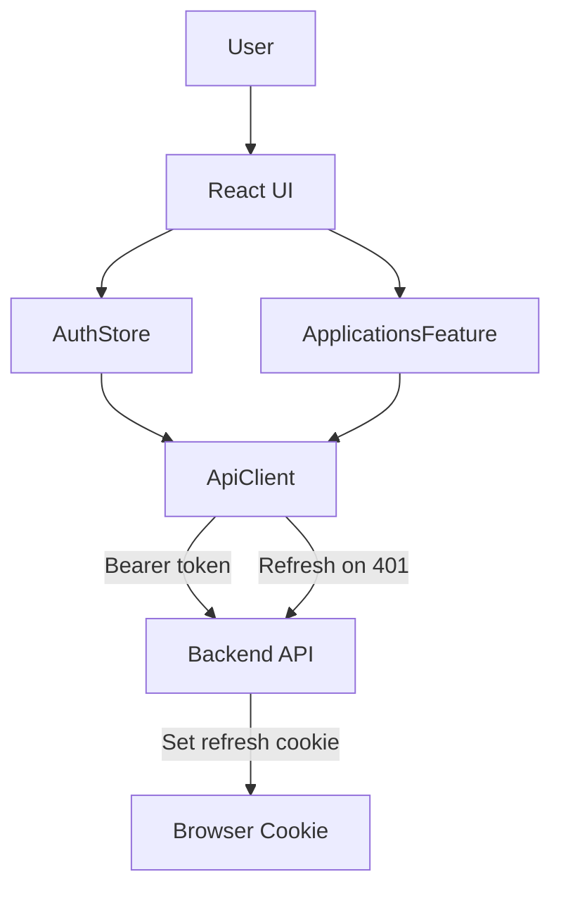

# Frontend MVP Plan

## Goals

- Implement secure auth (register/login/logout/refresh, `/auth/me`) with access token in memory and refresh-cookie flow.
- Build applications UI: list/filter/sort/paginate/add/edit/delete with status enum.
- Handle errors, loading, and empty states; enforce client-side validation matching backend rules.

## Scope & Stack

- Stack: Vite + React, JavaScript, HTML5, CSS (or CSS Modules), fetch API.
- Env: `VITE_API_BASE_URL` (required), optional `VITE_APP_NAME`.

## Architecture

- `src/api/client.js`: fetch wrapper with in-memory access token, 401 refresh-and-retry, `credentials: 'include'` for refresh.
- `src/store/auth.js`: auth context or Zustand-like store (user, accessToken, loading/error, actions: register, login, logout, refresh, loadMe).
- `src/routes` with React Router: public `/login`, `/register`; protected `/apps`.
- `src/features/applications/` for queries and mutations; local cache keyed by filters/pagination.

## Implementation Steps

- **conventions-docs**: In `Context/conventions.md` document naming/comment conventions, separation of concerns, cybersecurity best practices, unit testing approach; in `Context/folder-structure.md` capture proposed project structure aligned with backend.
- **bootstrap-vite**: Initialize Vite React/JS app, add routing, base layout, global CSS.
- **env-config**: Add `.env.example` with `VITE_API_BASE_URL`; load via `import.meta.env`.
- **api-client**: Create fetch helper for GET/POST/UPDATE/DELETE (use PATCH or PUT as appropriate); manage in-memory access token; on 401, call `/auth/refresh` with cookies, update token, retry once; logout on failure.
- **auth-store**: Implement auth context/store with actions (register/login/logout/refresh/me) and persistent user state in memory; gate routes with ProtectedRoute.
- **validation**: Mirror backend rules (email, password strength, name non-empty, application fields incl. URL/status, pageSize cap).
- **pages-auth**: Build login/register forms with inline validation, submit states, error display; post-success redirect to `/apps`.
- **layout-nav**: App shell with header showing user info and logout button; feedback toasts/banners for errors.
- **applications-ui**: CRUD page with filters (status), sort (date/status), pagination, add form (status defaults to APPLIED), edit (no URL change), delete with confirm; show loading/empty/error states.
- **error-handling**: Global error boundary/fallback; surface API errors per action; 401 retry once.
- **testing-smoke**: Add minimal tests or manual checklist for auth flows and app CRUD against backend; ensure `credentials: 'include'` on refresh.
- **conventions-docs**: In `Context/conventions.md` document naming/comment conventions, separation of concerns, cybersecurity best practices, unit testing approach; in `Context/folder-structure.md` capture proposed project structure aligned with backend.

## Deliverables

- React+Vite codebase with auth and applications features per contract.
- `.env.example`, README quickstart, and manual test checklist.

